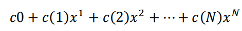
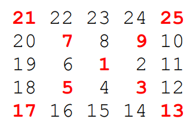

# Matlab Homework Tasks
## Task 1
**ENG**  
Write a function called holiday that takes two input arguments called month and day; both are scalar
integers representing a month (1-12) and a day (1-31). 
You do not need to check that the input is valid. 
The function returns a logical true if the specified date is a holiday; if not, it returns false. 
For the purposes of this exercise, the following dates are considered holidays: January 1st, July 4th, December 25th, and
December 31st

**RUS**  
Напишите функцию holiday, которая принимает два входных аргумента month и day; 
оба являются скалярными целыми числами, представляющими месяц (1-12) и день (1-31)
Вам не нужно проверять, что входные данные действительны.
Функция возвращает логическое значение true, если указанная дата является праздничной; если нет, то возвращает значение false. 
Для целей настоящего упражнения праздниками считаются следующие даты: 1 января, 4 июля, 25 декабря и 31 декабря
### [Solution](task1.m)

## Task 2
**ENG**  
Write a function called poly_val that is called like this p = poly_val(c0,c,x), where c0 and x are
scalars, c is a vector, and p is a scalar. If c is an empty matrix, then p = c0. If c is a scalar, then p = c0 + c*x. Otherwise, p equals the polynomial,



where N is the length of the vector c. 
Hint: you may want to use the .^ operator.  
Here are three example runs:
```MATLAB
>> format long
>> p = poly_val(-17,[],5000)
p =
 -17
>> p = poly_val(3.2,[3,-4,10],2.2)
p =
 96.920000000000030
>> p = poly_val(1,[1,1,1,1],10)
p =
 11111
 ```
**RUS**  
Написать функцию poly_val, где р = poly_val(c0,c,х), 
а c0 и x скаляры, c-это вектор, p - скаляр. 
Если c-пустая матрица, то p = c0. 
Если c-скаляр, то p = c0 + c*x. 
В противном случае p равно многочлену,


где N - длина вектора c.  
Подсказка: вы можете использовать .^ оператор.  
Вот три примера запуска:

```MATLAB
>> format long
>> p = poly_val(-17,[],5000)
p =
 -17
>> p = poly_val(3.2,[3,-4,10],2.2)
p =
 96.920000000000030
>> p = poly_val(1,[1,1,1,1],10)
p =
 11111
 ```

### [Solution](task2.m)

## Task 3
**ENG**

Write a function called approximate_e that uses the following formula to compute e, Euler’s number:
Instead of going to infinity, the function stops at the smallest k for which the approximation differs from exp(1) (i.e., the value returned MATLAB’s built-in function) by no more than the positive scalar, delta, which is the only input argument. The first output of the function is the approximate value of e, while the second is k. 
(Note: if your program or the grader takes a long time, you may have created an infinite loop and need to hit Ctrl-C on your keyboard.) 
You are not allowed to use the built-in function factorial.

**RUS**

Напишите функцию под названием approximate_e, которая использует следующую формулу для вычисления e, числа Эйлера:
Вместо того чтобы идти в бесконечность, функция останавливается на наименьшем k, для которого аппроксимация отличается от exp(1) (т. е. значение, возвращаемое встроенной функцией MATLAB) не более чем положительным скаляром, Дельта, которая является единственным входным аргументом. Первый вывод функции - это приблизительное значение e, а второй-k.
(Примечание: если ваша программа или грейдер занимает много времени, возможно, вы создали бесконечный цикл и вам нужно нажать Ctrl-C на клавиатуре.)
Вы не можете использовать встроенную функцию factorial.
### [Solution](task3.m)

## Task 4
**ENG**

Write a function called spiral_diag_sum that takes an odd positive integer n as an input and computes the sum of all the elements in the two diagonals of the n-by-n spiral matrix. 
For example, starting with the number 1 and moving to the right in a clockwise direction, a 5-by-5 spiral is formed as follows:



The sum of the red elements above is 101.  
Hint: the problem does not ask for the matrix itself.

**RUS**

Напишите функцию spiral_diag_sum, которая принимает нечетное положительное целое число n в качестве входных данных и вычисляет сумму всех элементов в двух диагоналях спиральной матрицы n-by-n.
Например, начиная с числа 1 и двигаясь вправо по часовой стрелке, спираль размером 5 на 5 образуется следующим образом:


Сумма красных элементов выше равна 101.  
Подсказка: проблема не требует самой матрицы.

### [Solution](task4.m)